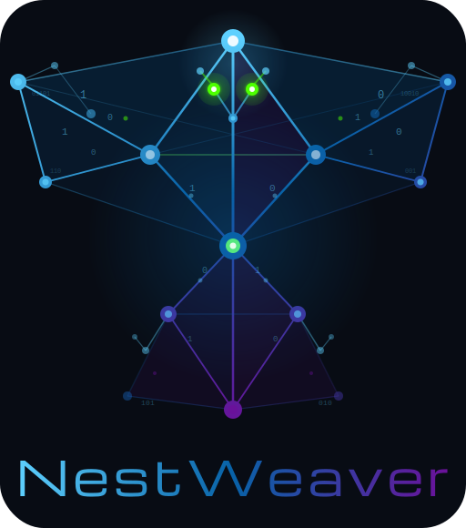

<p align="center">
  <picture>
    <source media="(prefers-color-scheme: dark)" srcset="assets/logo-full-dark.svg">
    <source media="(prefers-color-scheme: light)" srcset="assets/logo-full-light.svg">
    
  </picture>
</p>

<p align="center">
  <strong>Documentation site for NestWeaver — <a href="https://docs.nestweaver.kehl.io">docs.nestweaver.kehl.io</a></strong>
</p>

<p align="center">
  <a href="https://github.com/Kehl-io/nestweaver-docs/actions/workflows/ci.yml"></a>
  <a href="https://github.com/Kehl-io/nestweaver-docs/blob/main/LICENSE"></a>
</p>

---

## Tech Stack

Astro Starlight · Tailwind v4 · TypeScript · Pagefind search · Cloudflare Pages

## Prerequisites

- Node 24+

## Local Development

```bash
npm install && npm run dev
```

## Build

```bash
npm run build
```

Outputs to `dist/`.

## Check Suite

```bash
npm run lint && npm run type-check && npm run build
```

## Content

Docs live in `src/content/docs/` as Markdown files organized by section:

- **Getting Started** — Installation, Quick Start, Your First Query
- **Core Concepts** — Graph architecture, token budgets, PageRank, daemon
- **CLI Reference** — All CLI commands by category
- **MCP Tools** — 40 tools documented with parameters and examples
- **Configuration** — Instance config, language support, AI tool integrations
- **Integrations** — Claude Code, OpenClaw, HermesAgent setup guides
- **Guides** — Token efficiency, monorepo setup, brain/vault, CI integration

## Deployment

Automated via GitHub Actions:

- Push to `main` triggers [release-please](https://github.com/googleapis/release-please) to create/update a release PR.
- Merging a version tag triggers a Cloudflare Pages deploy.
- PRs get preview deploys with unique URLs.

## Links

- **Live site:** https://docs.nestweaver.kehl.io
- **NestWeaver repo:** https://github.com/Kehl-io/nestweaver
- **Marketing site:** https://nestweaver.kehl.io

## License

[MIT](LICENSE)

---

<p align="center">
  <a href="https://kehl.io">
    
  </a>
  <br>
  <sub>Built by <a href="https://kehl.io">kehl.io</a></sub>
</p>
